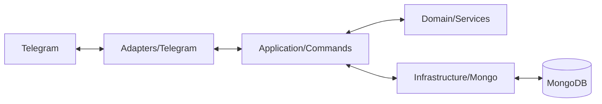

# Arquitetura do Strava Bot

O `strava_bot` é o projeto mais estruturado do ecossistema Assistant em termos de separação de responsabilidades, utilizando uma variante da **Clean Architecture** (Arquitetura Limpa).

## Camadas da Aplicação

### 1. Domínio (`domain/`)
O coração do bot. Contém a lógica de cálculo puro que não depende de como os dados são buscados ou exibidos.
- `RankService`: Algoritmos de ordenação por distância, ganho de elevação e tempo.
- `MedalService`: Regras para atribuição de medalhas de ouro, prata e bronze.
- `StreakService`: Lógica de detecção de sequências de dias ativos.
- `FrequencyService`: Cálculos de assiduidade.

### 2. Aplicação (`application/`)
Orquestra o fluxo de dados entre o usuário e o domínio.
- `commands/`: Implementação dos comandos de chat (ex: `/rank`, `/medalhas`). Transforma as intenções do usuário em chamadas aos serviços de domínio.
- `sync_activities.py`: Caso de uso responsável por buscar dados novos na API do Strava e salvar no banco de dados local.

### 3. Infraestrutura (`infrastructure/`)
Implementações de baixo nível e acesso a recursos externos.
- `mongo/`: Repositórios para acesso ao MongoDB, utilizando `assistant_model` como base para os documentos.

### 4. Adaptadores (`adapters/`)
A "borda" da aplicação que lida com frameworks externos.
- `telegram/`: O driver do `pyTelegramBotAPI`. Mapeia mensagens recebidas para os comandos na camada de aplicação e envia as respostas de volta para a rede.

## Diagrama de Fluxo

## Por que Clean Architecture?
Esta escolha permite que as regras de ranking sejam testadas de forma exaustiva sem a necessidade de um bot rodando ou um banco de dados real. Além disso, se no futuro o bot precisar ser migrado para Discord ou Slack, basta substituir a camada de `Adapters`.
