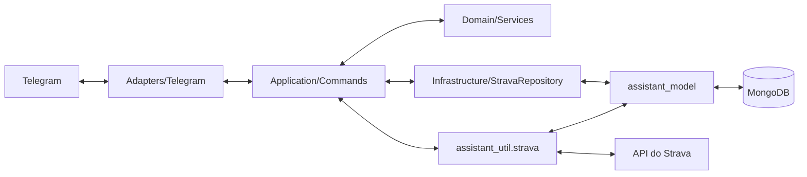

# Arquitetura do Strava Bot

O `strava_bot` é o projeto mais estruturado do ecossistema Assistant em termos de separação de responsabilidades, utilizando uma variante da **Clean Architecture** (Arquitetura Limpa).

## Camadas da Aplicação

### 1. Domínio (`domain/`)
O coração do bot. Contém a lógica de cálculo puro, que não depende de como os dados são buscados ou exibidos. As dependências entram por parâmetro.
- `RankService`: soma a métrica (distância ou tempo) por atleta. Qual métrica usar vem de fora (`assistant_util.strava.rank_metric`), a mesma regra das medalhas.
- `MedalService`: placar de medalhas. Aceita chave por athlete_id ou pelo nome legado.
- `StreakService`: sequências de dias ativos, a partir de um `today` injetado.
- `FrequencyService`: dias com atividade.

### 2. Aplicação (`application/`)
Orquestra o fluxo de dados entre o usuário e o domínio.
- `commands/`: os comandos de chat (ex: `/rank`, `/medalhas`). Recebem repositório e sync por parâmetro, com default.
- `common.py`: período de referência (mês/ano) e mensagens comuns. O "agora" é sempre o de Brasília (`agora_brasilia()`), porque o container roda em UTC.
- `sync_activities.py`: intervalo mínimo entre syncs + `assistant_util.strava.sync_group`. É o mesmo sync do `assistant_schedule`: janela de 7 dias com upsert, sem cursor.

### 3. Infraestrutura (`infrastructure/`)
- `strava_repository.py`: repositório fino sobre o `assistant_model.crud.strava`. O bot não tem models próprios.

### 4. Adaptadores (`adapters/`)
A "borda" da aplicação que lida com frameworks externos.
- `telegram/`: o driver do `pyTelegramBotAPI`. Mapeia mensagens para os comandos da aplicação e envia as respostas. Também tem o que é específico do Telegram:
  - o decorator `seguro`, que captura exceções e chama o `tratar_error`;
  - a checagem de admin do grupo;
  - o `extract_command`;
  - o `answer_callback_query`.

## Diagrama de Fluxo

```mermaid
graph LR
    TG[Telegram] <--> Adapter[Adapters/Telegram]
    Adapter <--> App[Application/Commands]
    App <--> Domain[Domain/Services]
    App <--> Repo[Infrastructure/StravaRepository]
    App <--> Sync[assistant_util.strava]
    Repo <--> Model[assistant_model]
    Sync <--> Model
    Sync <--> Strava[API do Strava]
    Model <--> DB[(MongoDB)]
```

## Por que Clean Architecture?
Esta escolha permite que as regras de ranking sejam testadas de forma exaustiva sem a necessidade de um bot rodando ou um banco de dados real. Além disso, se no futuro o bot precisar ser migrado para Discord ou Slack, basta substituir a camada de `Adapters`.
